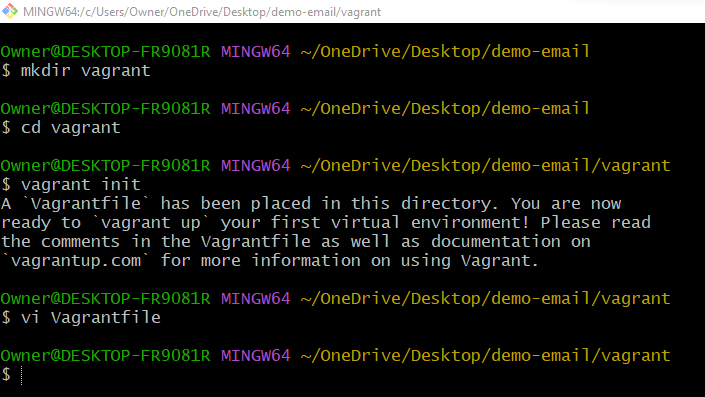
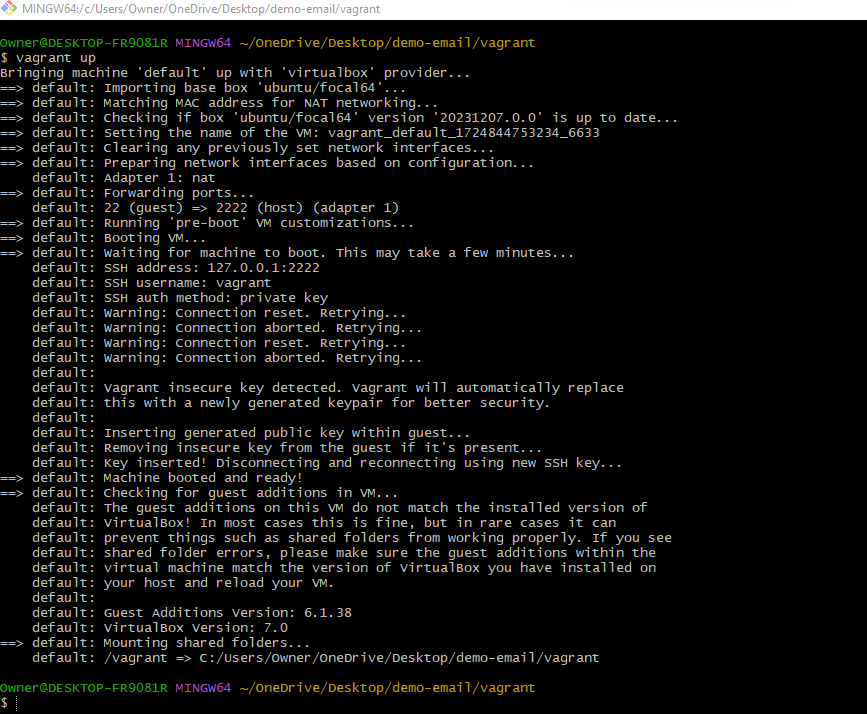
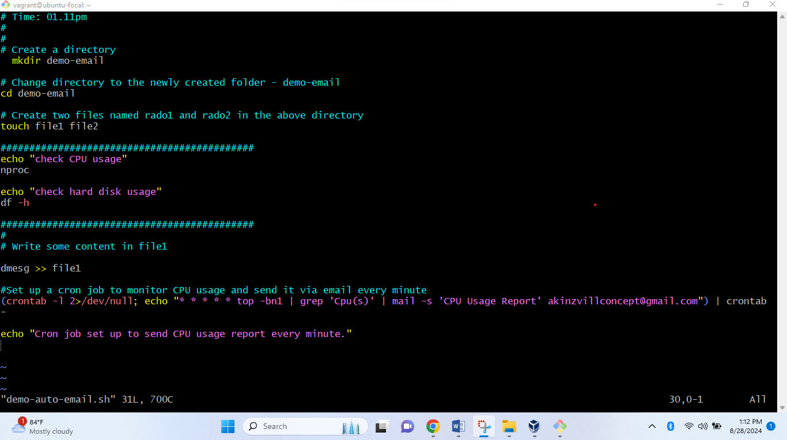
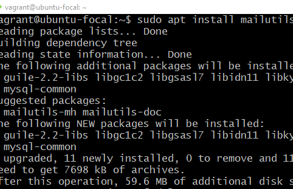
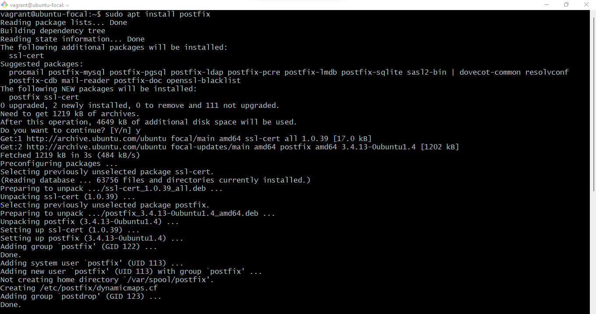
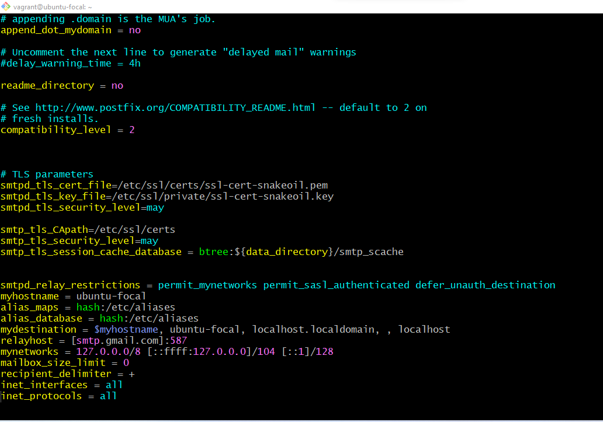
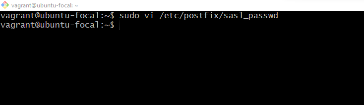
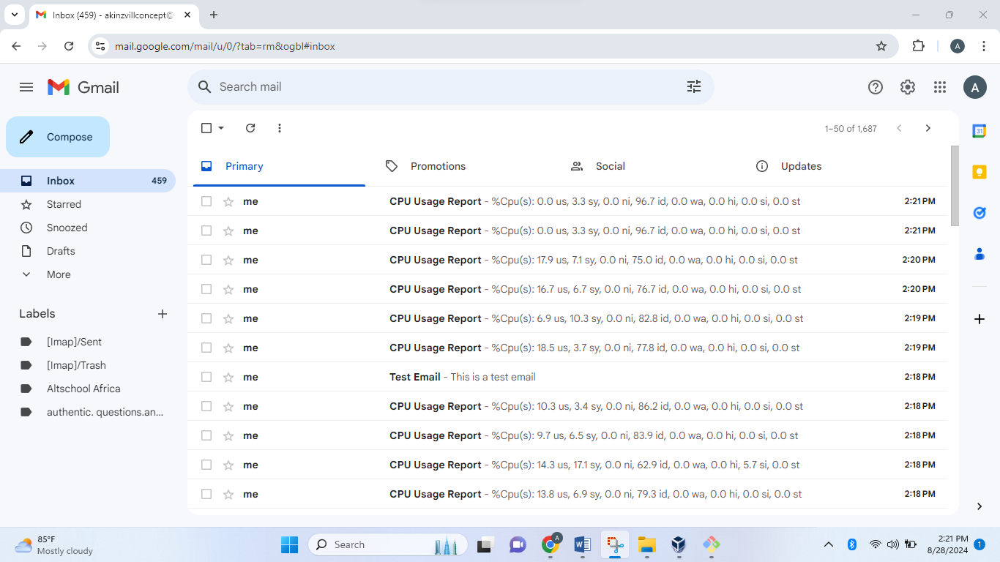

1. **Initializing Vagrant**:
   This image shows the command used to initialize a new Vagrant project.
   

2. **Starting the Vagrant VM**:
   This image demonstrates the command to start the Vagrant virtual machine.
   

3. **Accessing the Vagrant VM via SSH**:
   This image illustrates how to connect to the Vagrant VM using SSH.
   

# The following images demonstrate various aspects of the bash script setup and execution:

4. **Script Creation**:
   This image shows the process of creating the bash script file and its content (`demo-auto-email.sh`).
   

5. **Script Permission**:
   This image shows the process of granting necessary permission to the bash script (`demo-auto-email.sh`).
   

6. **Mailutils Installation**:
   This image shows the installation process of `mailutils`, a utility for handling email sending and receiving.
   

7. **Postfix Installation**:
   This image demonstrates the installation of Postfix, a popular mail transfer agent used for routing and delivering email.
   

8. **Postfix `main.cf` Configuration**:
   This image illustrates the configuration of the `main.cf` file in Postfix, which is essential for setting up the mail server's parameters.
   
   

9. **Email App Password Configuration**:
   This image shows how to configure the application-specific password for email, which is used for secure access to your email account.
   

10. **Confirming CPU Usage via Email**:
   This image captures the process of confirming CPU usage reports sent via email, demonstrating that the monitoring script is working correctly.
   

